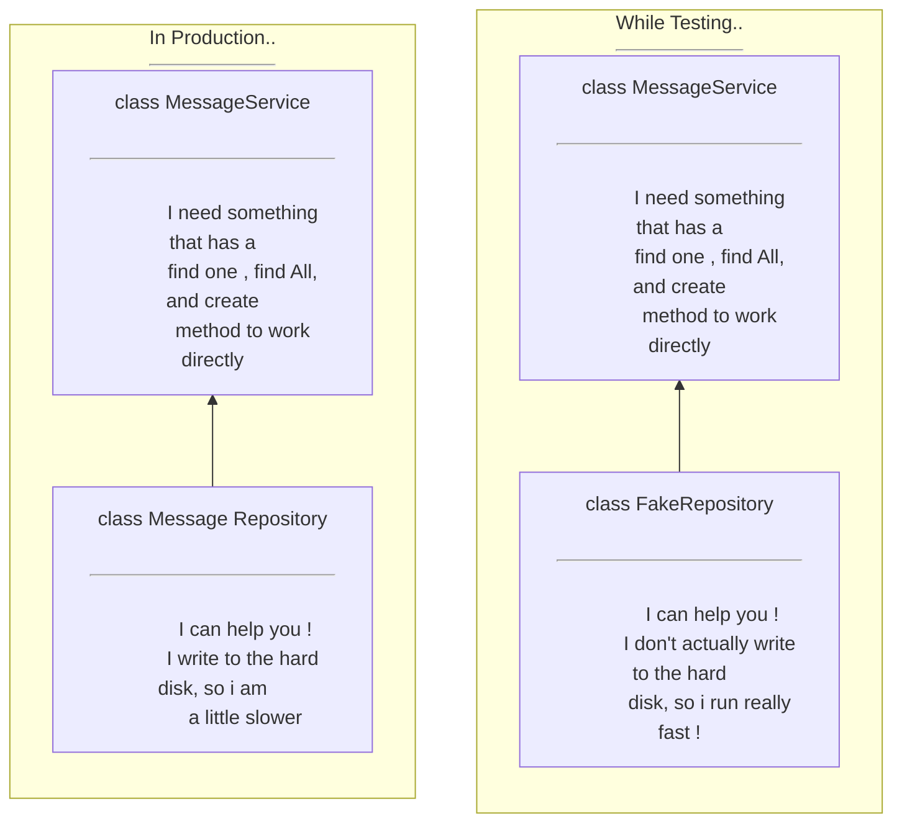
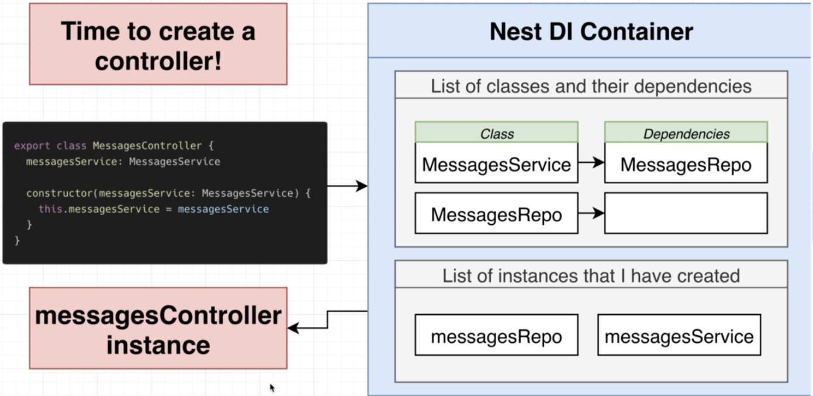

# NEST FLOW


---

### Some other parts:

- **_Modules :_** Groups together code.
- **_Filters :_** Handles errors that occur during request handling.
- **_Interceptors :_** Adds extra logic to incoming requests or outgoing responses.

## Decorators:

- ### Class Decorator :
  These decorator are applied to classes i.e **_@Controller_**, **_@Module_**, etc
- ### Method Decorator :
  These decorator are aplied to methods i.e **_@Get_**, **_@Post_**, etc
- ### Param Decorator :
  These decorator are applied to the arguments parameter i.e **_@Body_**, **_@Param_**, etc

# Dependency Injection :

**_Inversion of Control Principle :_**
Classes should not create instances of its dependencies on its own

### Example of code snippet written in different ways to show _Inversion of control principle_:

**_1. Bad_**
<br />
`MessagesService create its own copy of MessagesRepository`

```
export class MessageService{
    messagesRepo: MessagesRepository;

    constructor(){
        this.messagesRepo = new MessagesRepository();
    }
}
```

**_2. Better_**
<br />
`MessagesService receives its dependency.` <br/>
`Downside here is that it always relies upon specifically on a copy of messages repository being passed into the constructor.`

```
export class MessageService{
    messagesRepo: MessagesRepository;

    constructor(repo: MessagesRepository){
        this.messagesRepo = repo;
    }
}
```

**_3. Best_**
<br />
`MessagesService receives its dependency and it doesn't specificaly require 'MessagesRepository' `

```
interface Repository{
    findOne(id: string);
    findAll();
    create(content: string)
}

export class MessageService{
    messagesRepo: MessagesRepository;

    constructor(repo: Repository){
        this.messagesRepo = repo
    }
}
```
### Why the _Best_ case is good ?




# How dependency injection works ?
Dependency injection in nest works in container called ***Nest DI(Dependency Injection) Container/Injector***. It stores couple of properties. 

> To understand we can simplify these properties and say that it stores two sets of information. `List of classes and their dependencies`, and `List of that instances i have created.`

**Behind the scenes** a DI container is created for us when we create a new nest application. 
When our application is started nest is going to take a look at all the different classes that we have created inside the application except the controllers 




 