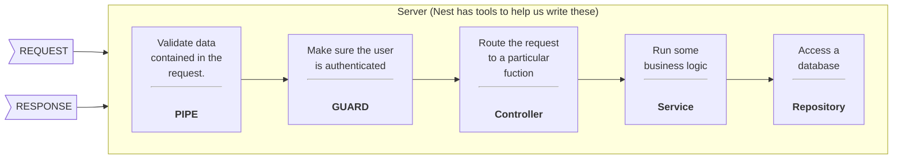

## NEST TOOLS

```mermaid

    graph LR
        A>REQUEST]
        B>RESPONSE]

        A --> Server
        B --> Server

        subgraph Server["Server (Nest has tools to help us write these)"]


            direction LR
            C[Validate data
            contained in the
            request.
                <hr/>
                <strong>PIPE</strong>
            ]
            D[Make sure the user
            is authenticated
                <hr/>
                <strong>GUARD</strong>
            ]
            E[Route the request
             to a particular
              fuction
                <hr/>
                <strong>Controller</strong>
            ]
            F[
                Run some
                business logic
                <hr/>
                <strong>Service</strong>
            ]
            G[
                Access a
                database
                <hr/>
                <strong>Repository</strong>
            ]
            
        end
        C --> D --> E --> F --> G
        

```
