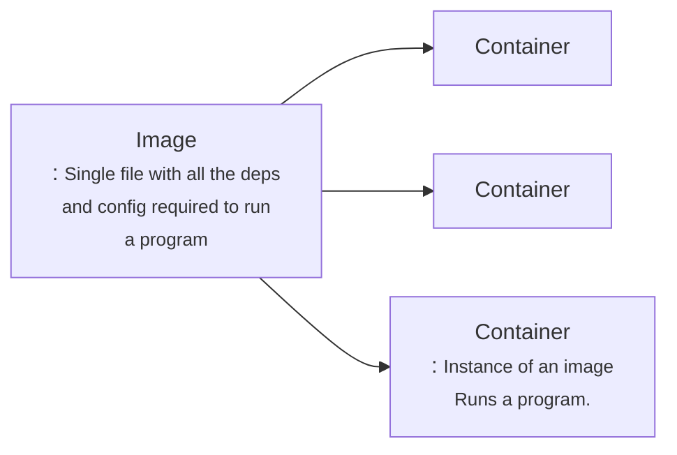

# Docker:

    Docker is a platform or ecosystem around creating and running containers.

when we run the comand i.e docker run,  the  docker cli reaches the docker hub and it downloads a single file called <strong>Image.</strong>

<strong>Container</strong> is a program with its own set of hardware resources 

## Docker Client

> ***Command*** :docker run hello-world
>
> Basically this command runned through docker cli will look into docker-server for images if not found then go into docker hub if found there then it will cache(for future use i.e no need to download it.) it and run the instance of that image i.e cotainer

## Container in detail : 

> ### 1. Overview of Operating system
>
> - ***Kernel*** : This kernel is a running software process that governs access between all the programs that are running on your computer and all physical hardware that is connected to your computer as well.

> ### 2. Hypothetical situation example
> 
>
> ***Namespacing***: The  entire process of  segmenting hardware resource based on the process asking it is known as namespacing.
>
>with namespacing we are allowed to isolate resources per a process or a group of proceeses.
>
> similarly closed to namespace we have one thing also called Controlled groups (croups).
>
> ***Control Groups***: Control groups is used to limit the amount of resource a particular group could used. 

> ### 3. So now container is: 
>
> The entire vertical block marked is referred to container. So container is not a physical contract, that exist inside our computer. Instead container is really a process , that have grouping specifically assigned to it. 

>### 4. What is the relation between a contsiner i.e singular process and grouping of resources into image. i.e how single file (image creates the container.)
>
> Anytime we are talking about image we are talking about file system snapshot which is essentially kind of like copy paste of very specific set of directories or files. Image also has a startup command.
>
>when we turn the image into container, firstly ***kernel*** is going to isolate little section of the hard drive and make it available to this shown container. so now we have chrome and python installed in the conatianer. Then when ***startup command*** is executed which we will invoke the process i.e chrome in our process then that process is isolated for this set of resources inside the container.

> 
>***Note***: : Kernel is not available in window or macos so while installation docker in window or mac os linux virtual machine is also downloaded and run while using docker. see the example below: 
>

537 completed
