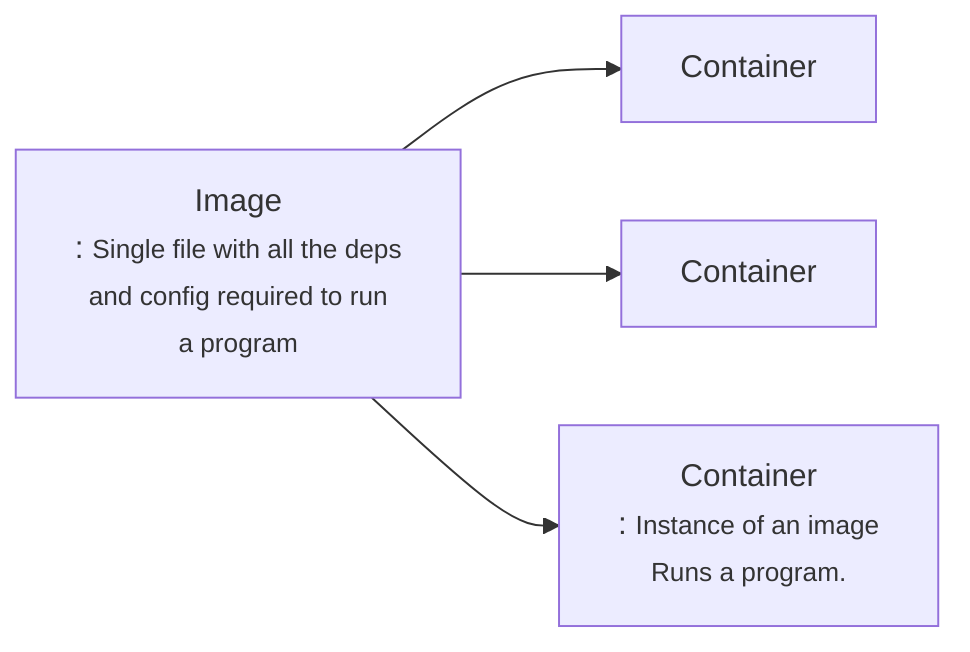

# Docker:

    Docker is a platform or ecosystem around creating and running containers.

when we run the comand i.e docker run, the docker cli reaches the docker hub and it downloads a single file called <strong>Image.</strong>

<strong>Container</strong> is a program with its own set of hardware resources

## Docker Client

> **_Command_** :docker run hello-world
>
> Basically this command runned through docker cli will look into docker-server for images if not found then go into docker hub if found there then it will cache(for future use i.e no need to download it.) it and run the instance of that image i.e cotainer

## Container in detail :

> ### 1. Overview of Operating system
>
> - **_Kernel_** : This kernel is a running software process that governs access between all the programs that are running on your computer and all physical hardware that is connected to your computer as well.
>   

> ### 2. Hypothetical situation example
>
> 
>
> **_Namespacing_**: The entire process of segmenting hardware resource based on the process asking it is known as namespacing.
>
> with namespacing we are allowed to isolate resources per a process or a group of proceeses.
>
> similarly closed to namespace we have one thing also called Controlled groups (croups).
>
> **_Control Groups_**: Control groups is used to limit the amount of resource a particular group could used.

> ### 3. So now container is:
>
> 
> The entire vertical block marked is referred to container. So container is not a physical contract, that exist inside our computer. Instead container is really a process , that have grouping specifically assigned to it.

> ### 4. What is the relation between a container i.e singular process and grouping of resources into image. i.e how single file (image creates the container.)
>
> 
> Anytime we are talking about image we are talking about file system snapshot which is essentially kind of like copy paste of very specific set of directories or files. Image also has a startup command.
>
> when we turn the image into container, firstly **_kernel_** is going to isolate little section of the hard drive and make it available to this shown container. so now we have chrome and python installed in the conatianer. Then when **_startup command_** is executed which we will invoke the process i.e chrome in our process then that process is isolated for this set of resources inside the container.

> **_Note_**: : Kernel is not available in window or macos so while installation docker in window or mac os linux virtual machine is also downloaded and run while using docker. see the example below:
> 

# Running a docker:

 

> ### Overriding default commands
> 
>
>
>eg:
> ***1. docker run busybox echo hi there***
>   - This command will override the default behaviour and will print **hi there**
>
>***2. docker run busybox ls***
>   - This command will show the list of files in cmd

### Listing all running containers:

***1. docker ps*** : This command will list all the running container.

    To see the list of container running u must have some conatiner running below is the example of command which will make container running for long bit of time.
    - docker run busybox ping google.com
    This will ping to google and get the result and will be kept running for long period of timming.

***2. docker ps --all***: This command will return the list of all the container ever runned.

### Container Lifecycle
 > ***docker run*** is the addition of two command i.e ***docker create*** and ***docker start***

***docker create hello-world*** : This will create a container and will return the container id.

***docker start -a <continaer_id>*** will run the container ***-a*** helps or makes docker watch for output from the container and print it out the terminal. By default ***docker start*** will only print the container id and output will be printed.

### Restarting a stopped container :
To run a container which is already exited , firstly run ***docker ps --all*** , which will return the details of all containers.

Then run ***dockeer start -a <container_id>*** to run the container.

**NOTE** : we can't overide the default commant of already exited container.

### To remove stopped containers:
***docker system prune***: this will remove all the stopped container and also the download images and will free up the space.

### Retrieving Output Logs: 
***docker logs <container_id>***: this command will return the logs of the already exited container. Note: This command will not rerunning or restarting the container.

### Stopping Containers :
For this We have two commands
- ***docker stop <container_id>***
- ***docker kill <container_id>***

**docker stop :** This command will  stop the container after processing all the request and then it will close. **Note :** If container didn't get stopped in 10 Sec then it will automatically run ***docker kill*** command.

**docker kill :** This command will instaneously stop the container forcefully without waiting for system process and saving processes.

545 completed
