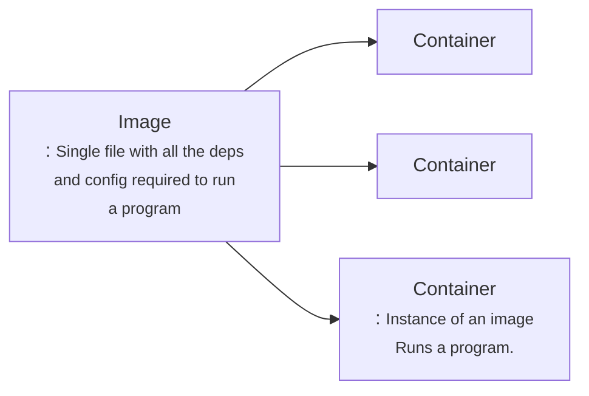

# Docker:

    Docker is a platform or ecosystem around creating and running containers.

when we run the comand i.e docker run,  the  docker cli reaches the docker hub and it downloads a single file called <strong>Image.</strong>

<strong>Container</strong> is a program with its own set of hardware resources 
527