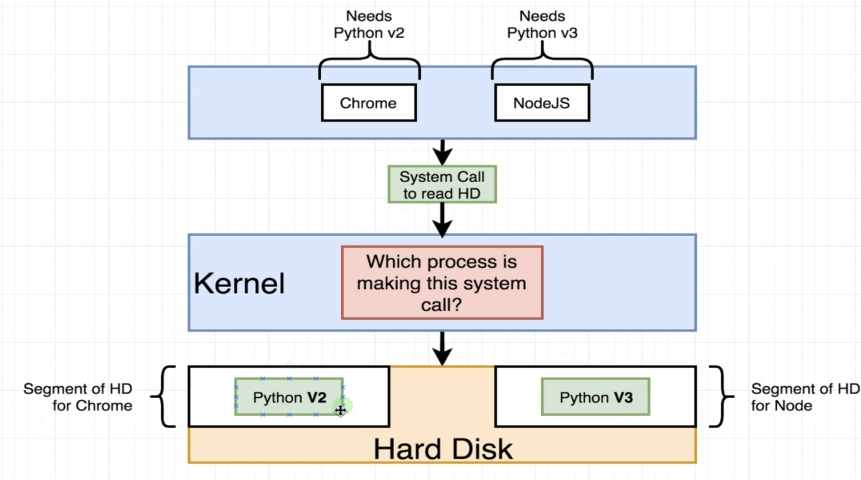

# Docker:

    Docker is a platform or ecosystem around creating and running containers.

when we run the comand i.e docker run, the docker cli reaches the docker hub and it downloads a single file called <strong>Image.</strong>

<strong>Container</strong> is a program with its own set of hardware resources

## Docker Client

> **_Command_** :docker run hello-world
>
> Basically this command runned through docker cli will look into docker-server for images if not found then go into docker hub if found there then it will cache(for future use i.e no need to download it.) it and run the instance of that image i.e cotainer

## Container in detail :

> ### 1. Overview of Operating system
>
> - **_Kernel_** : This kernel is a running software process that governs access between all the programs that are running on your computer and all physical hardware that is connected to your computer as well.
>   

> ### 2. Hypothetical situation example
>
> 
>
> **_Namespacing_**: The entire process of segmenting hardware resource based on the process asking it is known as namespacing.
>
> with namespacing we are allowed to isolate resources per a process or a group of proceeses.
>
> similarly closed to namespace we have one thing also called Controlled groups (croups).
>
> **_Control Groups_**: Control groups is used to limit the amount of resource a particular group could used.

> ### 3. So now container is:
>
> 
> The entire vertical block marked is referred to container. So container is not a physical contract, that exist inside our computer. Instead container is really a process , that have grouping specifically assigned to it.

> ### 4. What is the relation between a container i.e singular process and grouping of resources into image. i.e how single file (image creates the container.)
>
> 
> Anytime we are talking about image we are talking about file system snapshot which is essentially kind of like copy paste of very specific set of directories or files. Image also has a startup command.
>
> when we turn the image into container, firstly **_kernel_** is going to isolate little section of the hard drive and make it available to this shown container. so now we have chrome and python installed in the conatianer. Then when **_startup command_** is executed which we will invoke the process i.e chrome in our process then that process is isolated for this set of resources inside the container.

> **_Note_**: : Kernel is not available in window or macos so while installation docker in window or mac os linux virtual machine is also downloaded and run while using docker. see the example below:
> 

# Running a docker:

 

> ### Overriding default commands
> 
>
>
>eg:
> ***1. docker run busybox echo hi there***
>   - This command will override the default behaviour and will print **hi there**
>
>***2. docker run busybox ls***
>   - This command will show the list of files in cmd

### Listing all running containers:

***1. docker ps*** : This command will list all the running container.

    To see the list of container running u must have some conatiner running below is the example of command which will make container running for long bit of time.
    - docker run busybox ping google.com
    This will ping to google and get the result and will be kept running for long period of timming.

***2. docker ps --all***: This command will return the list of all the container ever runned.

### Container Lifecycle
 > ***docker run*** is the addition of two command i.e ***docker create*** and ***docker start***

***docker create hello-world*** : This will create a container and will return the container id.

***docker start -a <continaer_id>*** will run the container ***-a*** helps or makes docker watch for output from the container and print it out the terminal. By default ***docker start*** will only print the container id and output will be printed.

### Restarting a stopped container :
To run a container which is already exited , firstly run ***docker ps --all*** , which will return the details of all containers.

Then run ***dockeer start -a <container_id>*** to run the container.

**NOTE** : we can't overide the default commant of already exited container.

### To remove stopped containers:
***docker system prune***: this will remove all the stopped container and also the download images and will free up the space.

### Retrieving Output Logs: 
***docker logs <container_id>***: this command will return the logs of the already exited container. Note: This command will not rerunning or restarting the container.

### Stopping Containers :
For this We have two commands
- ***docker stop <container_id>***
- ***docker kill <container_id>***

**docker stop :** This command will  stop the container after processing all the request and then it will close. **Note :** If container didn't get stopped in 10 Sec then it will automatically run ***docker kill*** command.

**docker kill :** This command will instaneously stop the container forcefully without waiting for system process and saving processes.

### Redis / (Executing commands in running containers) 
***docker run redis :*** it will start  intance of container if available if not available then it will download and run it.

>After running redis instance run the below command to use redis :
>
> ***docker exec -it <conatiner_id> redis-cli*** 
>
>now redis terminal get started
>
>***set myvalue 5*** (for setting value in myvalue variable)          
>***get myvalue*** (for getting value from myvalue variable)
>

### The purpose of it flag
- When we are running docker in our machine every single container we are running is running inside a virtual machine running on linux. so these processes are being executed inside our linux world, even if we are o n **mac** or  **window**

**Explanation of above diagram:**      
- Every proces we create in linux has three channels attached to it. These channels are used to communicate information in to the process or out of the process .
    - STDIN : It is used to communicate infomation into the process.
    - STDOUT : It is used to convey the information that is comming outside the process. This is redirected over to the our running terminal that is gone end up after showing the infomation to the screen.       
    - STDERR: It conveys infomation out of the process that is like error in nature , so if redis-cli has some error that will be communicated outside the world over the standard error channel. 

***Now what's the relation b/w __it__ flag***
> The -it flag is combination of 2 different flags i.e ***-i*** and ***-t***      
> ***-i :*** command means when we execute the new commands inside the container we want to attach our terminal to the **STDIN** channel of the new running process.     
> ***-t :*** flag is that what makes the text look little bit preety,(In reality it's doing more then that) withou **-t** there is no indentation , no autocomplete it's just the raw information. 

### Getting a command prompt in a container.
To run command inside a container without everytime using ***docker exec*** again and again. we will use the command :  

> ***docker exec -it <container_id> sh***   
> After running this there is no need to run ***docker exec*** command again .

**What is sh ?**

**sh** is a name of program that is being executed inside of the container.  
It is a command processor or shell , something that allow us to types command in and have them executed inside that containers.

### Starting with a shell :

***docker run -it busybox sh :*** the downside to run this command with sh is that you can't run another process .

### Creating docker images :

**Docker File :** is a plain text file that is going to have a couple of line of configurations inside of it . This configuation defines how our container should behave or specifically what different programs it's going to contain and what it does when it start's up as container.

**Inside Every docker file we have following things:**

 

### Building a docker file
In this we will create an image that runs **redis-server**
[This project is available in this repo in docker > projects > redis-image]

**Now run this run command ***docker build .*** from the file where it is place**

### Dockerfile teardown (i.e explaining what we have done above to make docker file)

### Base image :
    To understand this firtly we'll see the lit bit of analogy i.e
    writing a docker file is just similar to being a computer with no os and being told to install chrome.

By default when we create an image we have an empty image, there is nothing there.  
So the purpose of specifying the base image is a kind of give us intial starting point or intial set of programs we can used to further customize. [THAT IS THE PURPOSE OF FIRST LINE I.E FROM alpine]
i.e we say we want to use the **Alpine** docker image as kind of intial operating system or a starting point for the image we are creating

**Why did we use alpine ?**

In short , we just made use of alpine as a base image as kind of like an operating system, becuse it includes differrent set of programs that is very useful for what we want to accomplished i.e we are trying to install and run **redis**.

Alpine base image has a set of programs inside it that are very useful for installing and running redis.

The command use to install redis is :  ***RUN apk add --update redis***. This is not the docker command and has nothing to do with docker. **apk** is appche packag manager that comes preinstalled on the **alpine** image that we can use this package manager built into alpine to automatically, download and install the redis for us.

### The build process in Detail
> will makes notes later [557]

**Brief explaiation pic**

### Rebuilds with cache :
Docker behinds the scene uses cache mechanism while building image which will make it more performant. - [559]

### Tagging an image :
we build image from docker file using ***docker build .*** command which in returns gives **image id**. we create the container of the created image with the help of the image id we get using the command ***docker run <image_id>***  

so we can change the process of creating conatianer using image id of our custom image with the slightly different syntax called **tagging**

**Below is the syntax explanation**

to run the image after tagging the command is :   
 ***docker run docker.io/varunbakshi238/redis:lastest***

559 completed