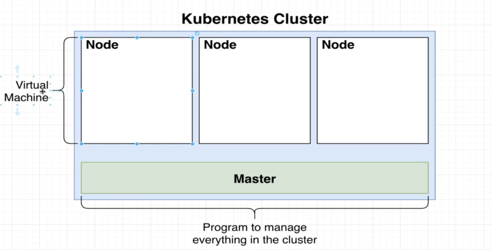
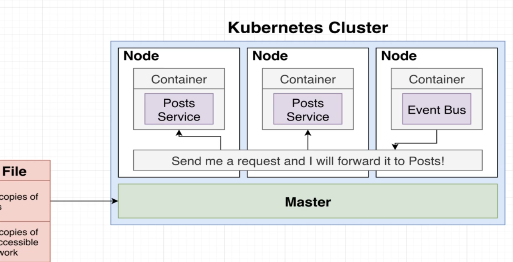
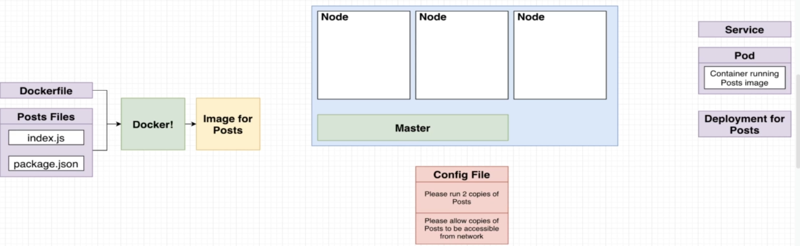
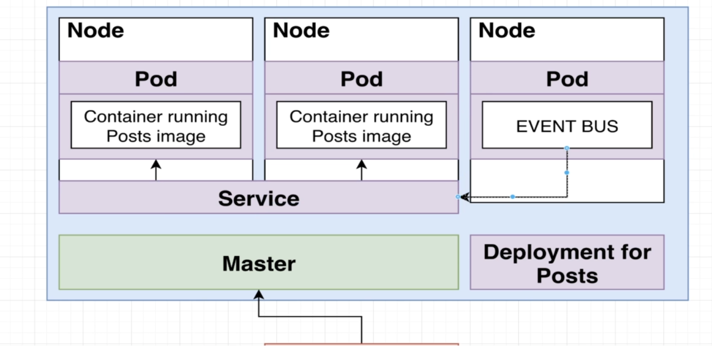

### Kubernates:
It is a tool for running a bunch of containers. we give it some configuration to describe how we want our containers to run and interact with each other.

### Kubernates cluster:
A cluster is a set of different virtual machines, it can have one or thousands of virtual machine. All these virtual machine we refer to as **node** .

They all are anaged by something called **master**. It is a program that's going to manage everything inside a cluster, i.e all the different programs which are running, all the different aspects of these virtual machine and etc.   
we are going to tell kubernates to run some program for us, then it will assign it to the one of the rendom nodes.

### Why kubernates ?

### KubernatesTour :
***kubectl version :*** The command to know kubernates version.

**Explanation :**
> - From the image of posts we can create as many container/instances of posts image.    
> - We will depoy these on kubernates cluster.   
> - A Node in kubernates cluster is a virtual machine, it is essentially a computer which run number of containers for us.
> - To create a container out of post image, we will create the configuration file(as shown in pic above)     
> - We will feed the config file into kubernates.Kubernates will read the file and will look for copy of posts images as per the config file. Kubernates distributes the container among these node.    
> - Each container i.e hosted is created inside a pod
> - pod and container are not the same thing, A pos wraps the container and can have multiple container inside it.
> - To manage this pods kubernates will create something called deployment.     
> - If anything goes wrong with the pod then its responsibility of deployment to recreate it, and all the pods are running succesfully.    
> - For second step of config file i.e allow access to other post service from other pods, kubernates create something called services. 
> - Service gives us the access of all the pods inside the cluster, this helps in handling the networking between different microservices.
> - Eventbus will easily reach out to the service instead of reaching to the pod.

65 completed